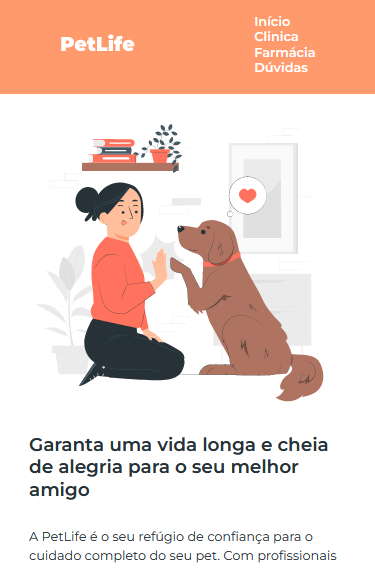
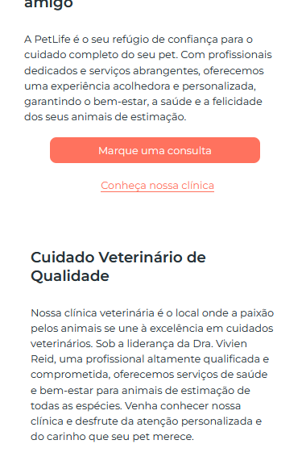
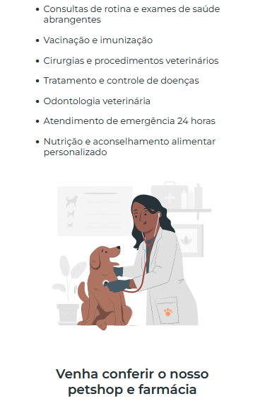
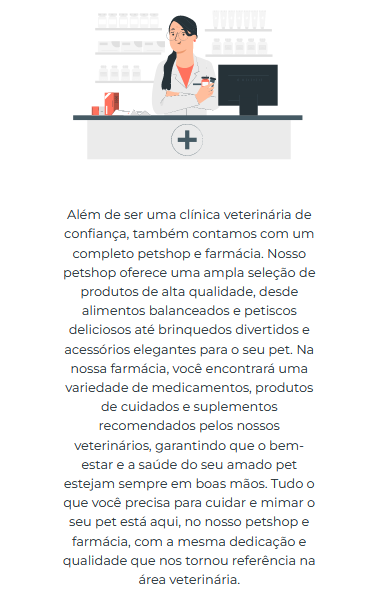
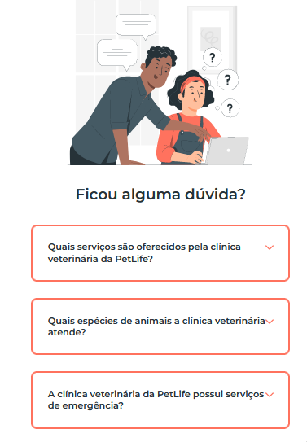
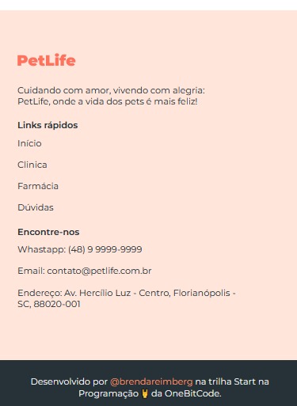

# Projeto Site PetShop
Site elaborado durante o mini curso da OneBitCode.

## Objetivo:
Aprimorar os conhecimentos em linguagem de marcação HTML, linguagem de estilo CSS e liguagem JS.

## Resultado
#### A primeira imagem mostra o inicio do site onde estão informações como logo e área de navegação da página no cabeçalho.  

  
 
#### A segunda imagem mostra a continuação da página com o primeiro conteúdo de informações da página sendo o artigo "Garanta uma vida longa e cheia de alegria para o seu melhor amigo".  
#### Nesse artigo foi necessário criar dois links sendo um deles em forma de botão.

  

#### A terceira imagem mostra o segundo artigo dentro da página sobre "cuidado veterinário de qualidade" contendo um texto e uma lista contendo informações de atendimento.
  

#### A quarta imagem é outro artigo com o intuito de informar, quem acessar a página, sobre o petshop e a farmácia.
  

#### A quinta imagem mostra a área de perguntas frequentes do site que podem ser acessadas clicando nas perguntas e logo abaixo aparecendo a resposta.
  

#### Na última imagem está o rodapé da página onde constam o logo, o slogan, área de links rápidos, os meios de contato e por fim a área com informações de quem desenvolveu e a empresa que tornou o projeto possível.
  

### REFERÊNCIA
